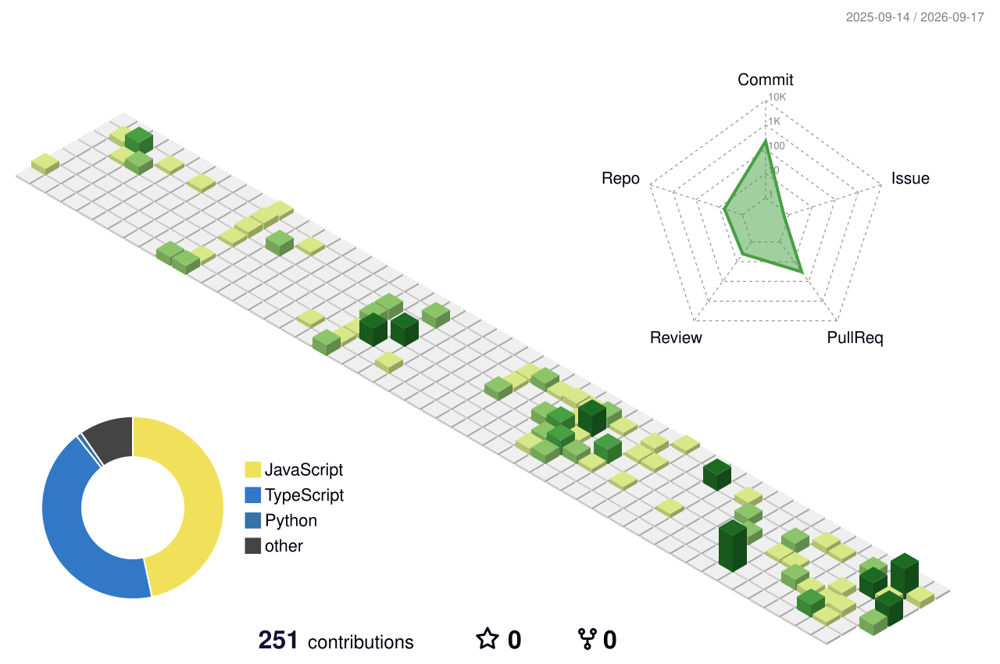

# Renz — Full-Stack Software Engineer

*Building with care & craft · Iloilo City, Philippines 🇵🇭*

[Portfolio](https://renzoportfolio.vercel.app) · [Email](mailto:renbriel44@gmail.com) · [LinkedIn](https://www.linkedin.com/in/renzo-gabriel-laporno-029aa8277)

---

  <picture>
    <source media="(prefers-color-scheme: dark)" srcset="profile-3d-contrib/profile-night-rainbow.svg">
    <source media="(prefers-color-scheme: light)" srcset="profile-3d-contrib/profile-green-animate.svg">
    
  </picture>

---

## About

Full-stack developer building production systems at an agency — owning the stack end to end: frontend, backend, database, auth, and deployment. I ship real enterprise software, care about craft and user experience, and bring 3D, animation, and AI into production work.

Currently at **Prometheus PH**, open to **remote, USD-comp roles**.

---

## Things I've Shipped

**[Daily Guardian](https://dailyguardian.com.ph)** — headless news platform, **100k+ monthly visitors**
Legacy WordPress migrated to headless Next.js, WordPress serving content via REST API, deployed on Cloudflare for edge performance.
`Next.js` `WordPress` `Headless CMS` `Cloudflare` `TypeScript`

**[JCI Regatta Iloilo](https://jciregattailoilo.org)** — official event site for a sailing competition
Registration, interactive brochures, and GSAP-driven animation.
`Astro 4` `GSAP` `Tailwind`

---

## Stack

`React` `Next.js` `TypeScript` `Node.js` `Astro` `Tailwind CSS`
`PostgreSQL` `Prisma` `Firebase` `AWS` `GSAP` `Framer Motion`

---

## Experience

**Prometheus PH** — Software Engineer, Full Stack · *June 2025 — Present*
Leading full-stack projects end to end, full ownership of architecture and delivery.

**Trajector** — Software Engineer Intern · *Oct 2024 — Mar 2025*
Automated ticket pipelines on AWS; built an AI-powered résumé-parsing system.

**Freelance** — Web Developer · *2024 — Present*
Designed and built the Meisner Institute site.

---

Open for freelance, collaborations & full-time roles — remote, USD comp.

[**Get in touch ↗**](mailto:renbriel44@gmail.com)

